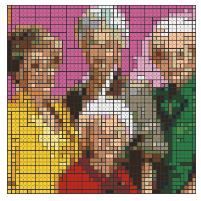
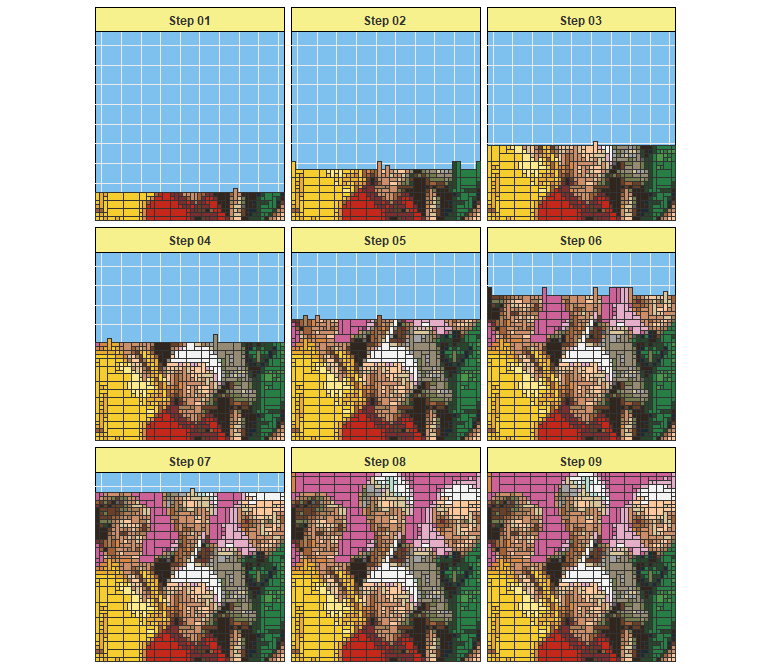
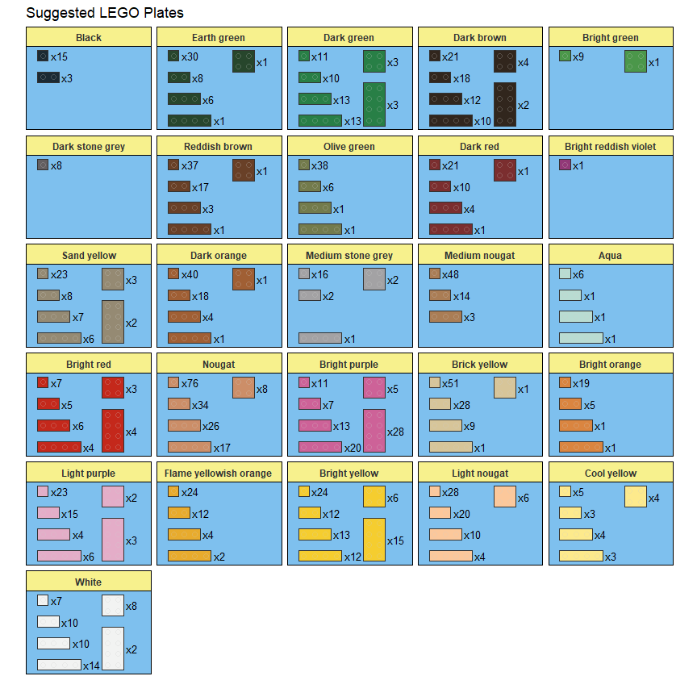
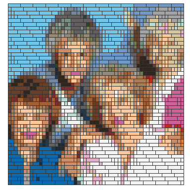
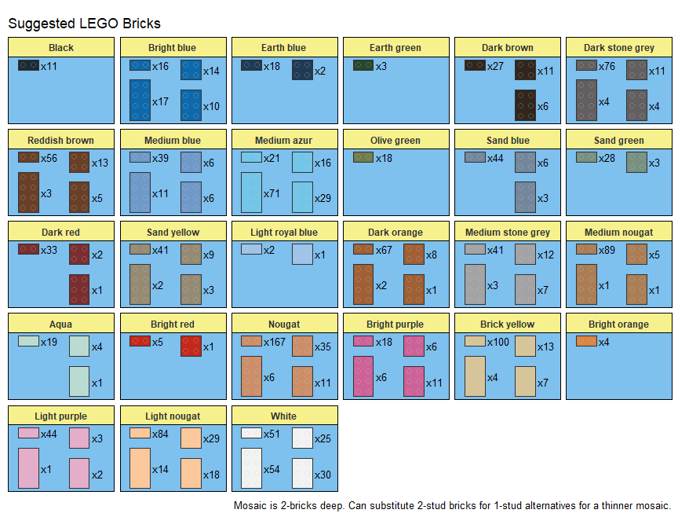

LEGO Mosaics in R
================

Introduction
------------

The functions in the file `0_functions.R` convert a jpg or png image into a mosaic of available LEGO colors and bricks using the R [tidyverse](https://www.tidyverse.org/) and the `jpeg` or `png` packages.

A full explanation can be found on [this blog post](http://www.ryantimpe.com/2018/04/23/lego-mosaic1/).

 

This process is competed in a few distinct steps:

-   `scale_image()` reduces the image to a number of brick "pixels". Providing a single value, such as `48`, crops the image to a square. Inputting a 2-element array, `c(56, 48)`, will output a rectangular image of `c(width, height)`.

-   `legoize()` converts every brick-sized pixel in the scaled image to an official LEGO brick color. Those colors are stored in `Colors/Lego_Colors.csv`. By default, the functions look at only currently produced, non-transparent colors.

-   `collect_bricks()` looks for adjacent groups of the same color to replace single 1 x 1 bricks with larger bricks.

-   `display_set()` renders the LEGO mosaic as a plot for viewing, creating the image above.

``` r
mosaic1 <- readJPEG("Images/goldengirls.jpg") %>% 
  scale_image(48) %>%
  legoize() %>% 
  collect_bricks() 

mosaic1 %>% display_set()
```

LEGO Mosaics IRL
----------------

Additional functions assist in the translation from the LEGO mosaic image into a real LEGO set.

### Instructions

Use `generate_instructions()` to break the LEGO mosaic image into easier-to-read steps for building the set. This defaults to 6 steps, but passing any integer value will generate that many steps.

``` r
mosaic1 %>% generate_instructions(9)
```



### Piece list and count

Use `display_pieces()` to generate a graphic and count of all required plates or bricks (for stacked mosaics). These are sorted by color and size for easy purchase on LEGO.com's [Pick-a-Brick](https://shop.lego.com/en-US/Pick-a-Brick) section using the advanced search option. Alternatively, use `table_pieces()` to produce a data frame table of all required bricks.

``` r
mosaic1 %>% display_pieces()
```



Stacked mosaics
---------------

The default produces instructions for a flat LEGO mosaic, with all bricks placed "stud-up" on a plate. Alternatively, specifying `mosaic_type = "stacked"` in the `collect_bricks()` function will generate a mosaic where all bricks are stack on top of each other, resulting in the mosaic image being visible from the side.

A 1 x 1 LEGO brick is taller than it is wide by a ratio of 6/5, so it's recommended to use a wider image.

``` r
m2_lego <- readJPEG("Images/goldengirls2.jpg") %>% 
  scale_image(c(56, 48)) %>% #c(Width, Height) for rectangle
  legoize() %>% 
  collect_bricks("stacked") 
```



``` r
mosaic2 %>% display_pieces()
```


